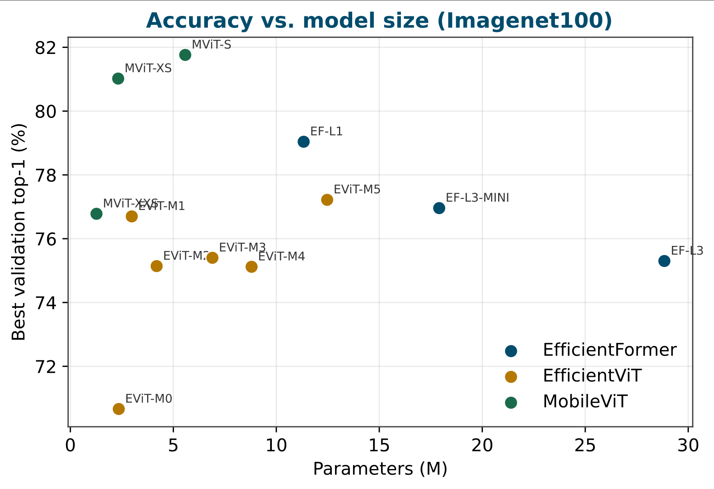
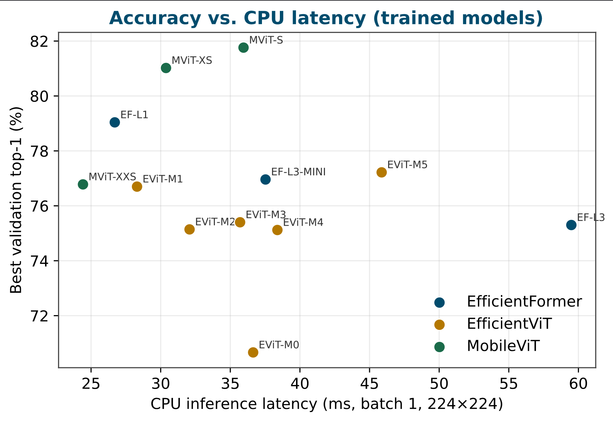
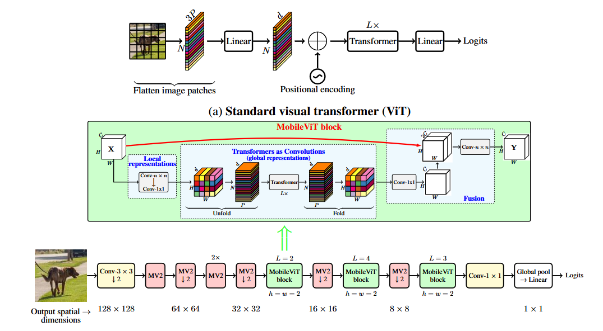
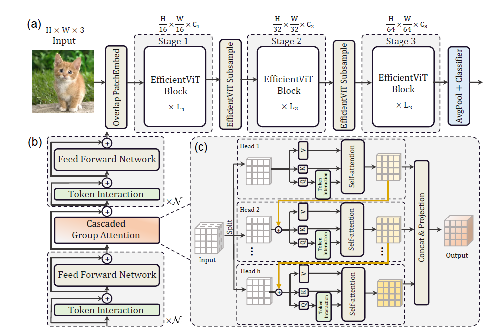
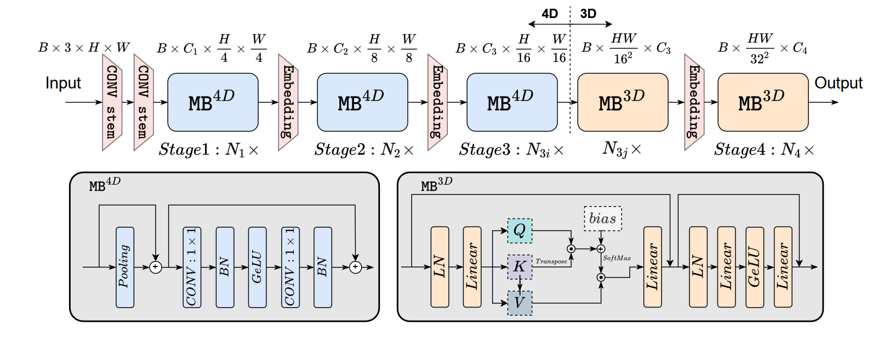

# Light-weight ViTs

A practical, unified PyTorch library of **light-weight vision backbones**. It
gathers a set of efficient image models behind one consistent interface, so you
can build, train, evaluate, benchmark, and run inference on any of them the same
way. Image classification is the built-in head and the benchmark used here, but
it is not a limit: every model also exposes its feature extractor, so the
backbones drop straight into downstream tasks (detection, segmentation,
retrieval, …).

The models come from two places but behave identically:

- **Implemented from scratch** — clean, bottom-up, heavily-documented code for the
  **MobileViT**, **EfficientViT**, and **EfficientFormer** families, so the
  architectures are easy to read, modify, and learn from.
- **Thin wrappers around torchvision** — so well-tested CNN baselines are reused
  rather than re-implemented: **ShuffleNetV2**, **EfficientNet** (B0–B7 and V2),
  and **MobileNetV2 / V3**.

Whichever it is, every model satisfies the same contract and is reachable through
one **registry** (`create_model`), trained by one **Trainer**, used through one
**Predictor**, benchmarked by one **latency** script, and covered by one **test
suite**. Dependencies stay minimal — just PyTorch, torchvision, and Pillow.

---

## Model families at a glance

| Family            | Token mixer                                  | Layout            | Variable input? |
|-------------------|----------------------------------------------|-------------------|-----------------|
| MobileViT         | Transformer over unfolded patches            | hybrid CNN/ViT    | **yes** (dynamic patch fold) |
| EfficientViT      | Cascaded Group Attention in local windows    | spatial `(B,C,H,W)` | no (fixed-resolution bias) |
| EfficientFormer   | Pool mixer (4D) + token attention (3D tail)  | 4D → 3D           | no (fixed-resolution bias) |
| torchvision CNNs  | convolution                                  | spatial           | **yes** (adaptive pool) |

EfficientViT and EfficientFormer use relative-position / attention-bias tables
that are **tied to a fixed spatial resolution**. They validate their input size
at run time and are excluded from multi-scale training (see below). MobileViT and
the torchvision CNNs accept arbitrary input sizes.

---

## Project layout

```
Light-wight ViTs/
├── models/
│   ├── common.py              # validation, param counting, weight init, make_divisible
│   ├── stochastic.py          # DropPath + Residual (shared stochastic depth)
│   ├── layers.py              # ConvBN, ConvNormAct, BNLinear, SqueezeExcite (+ BN fusion)
│   ├── mobilenetv2.py         # MobileViT primitives: Pointwise/Depthwise conv, MV2 block
│   ├── transformer.py         # MobileViT Transformer: SelfAttention, MLP, EncoderBlock, ...
│   ├── mobilevit_block.py     # MobileViT hybrid block (unfold → transformer → fold → fuse)
│   ├── mobilevit.py           # MobileViT model + mobilevit_{xxs,xs,s}
│   ├── efficientvit_layers.py # PatchEmbed, FFN, PatchMerging, EfficientViTSubsample
│   ├── efficientvit_block.py  # CascadedGroupAttention, LocalWindowAttention, EfficientViTBlock
│   ├── efficientvit.py        # EfficientViT model + efficientvit_m0..m5
│   ├── efficientformer_block.py # ConvStem, downsample, PoolMixer, MB4D, attention, MB3D
│   ├── efficientformer.py     # EfficientFormer model + l1/l3/l7 (+ l3_mini/l7_mini)
│   ├── torchvision_models.py  # torchvision builders wrapped to the unified contract
│   ├── configs.py             # all frozen config dataclasses + per-variant factories
│   └── registry.py            # create_model() / list_models() over every model
├── data/
│   ├── datasets.py            # ImageNet-100 (ImageFolder) builder + constants
│   ├── transforms.py          # ImageNet train/eval pipelines
│   └── loaders.py             # fixed-scale + multi-scale loaders, MultiScaleSampler
├── training/
│   ├── metrics.py             # top-k accuracy + precision/recall/F1 (macro/micro/weighted)
│   ├── optimizer.py           # build_optimizer (4) + build_scheduler (6) + SchedulerSpec
│   ├── trainer.py             # unified trainer: AMP, grad-clip, best.pt, throughput, all metrics
│   ├── checkpoint.py          # save/load (best.pt; state_dict only)
│   └── config.py              # TrainConfig (full run hyperparameters)
├── inference/
│   └── predictor.py           # Predictor: registry-built, top-k, batched, checkpoint loading
├── scripts/
│   ├── train.py               # universal training: --model X --data-root ... ...
│   ├── infer.py               # thin CLI → Predictor
│   └── latency.py             # latency benchmark across all registered models
├── tests/                     # pytest suite (configs, registry, forward, metrics, trainer, ...)
├── weights/                   # bundled ImageNet-100 checkpoints: <model>.pt (state_dict)
├── assets/
│   ├── architectures/         # MobileViT.png, EfficientViT.png, EfficientFormer.png
│   └── figures/               # fig_acc_params.pdf, fig_lat_acc.pdf (result plots)
├── notebooks/                 # imagenet100_train.ipynb (end-to-end training)
├── pytest.ini
└── conftest.py                # puts this package on sys.path for pytest
```

---

## Unified model contract

Every model — hand-written or torchvision-wrapped — exposes the same interface:

```python
model.forward(x)              # (B, C, H, W) -> (B, num_classes)
model.forward_features(x)     # backbone features, no head (spatial map or pooled)
model.reset_classifier(n)     # swap in a fresh head; n=0 -> headless backbone
model.num_features            # width of the pooled feature vector
```

This uniformity lets the trainer, predictor, and benchmark treat all families
identically — and lets you use any model as a **feature-extracting backbone**:
call `forward_features(x)` for the pre-head features (a spatial `(B, C, H', W')`
map for MobileViT/EfficientViT, ideal for dense downstream tasks; a pooled
vector otherwise), or `reset_classifier(0)` to drop the head entirely.
Classification is simply the default head these backbones ship with, not a
restriction.

---

## Models

List them at runtime:

```python
from models import list_models, list_families
list_models()                       # all 32 names
list_models(family="efficientvit")  # one family
list_models(dynamic_input=True)     # only models safe for multi-scale training
```

- **MobileViT** — `mobilevit_xxs`, `mobilevit_xs`, `mobilevit_s`
- **EfficientViT** — `efficientvit_m0`, `m1`, `m2`, `m3`, `m4`, `m5`
- **EfficientFormer** — `efficientformer_l1`, `efficientformer_l3`, `efficientformer_l7`,
  `efficientformer_l3_mini`, `efficientformer_l7_mini`
- **torchvision** (prefix `torchvision_`) —
  `shufflenet_v2_x0_5/x1_0/x1_5/x2_0`,
  `efficientnet_b0`…`b7`, `efficientnet_v2_s/v2_m/v2_l`,
  `mobilenet_v2`, `mobilenet_v3_small`, `mobilenet_v3_large`

---

## Installation

```bash
pip install torch torchvision pillow      # runtime
pip install pytest                          # tests (optional)
```

Pure PyTorch + torchvision + Pillow — no `timm` or other extra dependencies.
Tested with PyTorch 2.x and torchvision 0.2x (CUDA optional).

---

## Model registry

```python
import torch
from models import create_model, get_model_info

# Dynamic-input model: image size is flexible.
m = create_model("mobilevit_xs", num_classes=100)
m(torch.randn(1, 3, 256, 256)).shape          # torch.Size([1, 100])

# Fixed-resolution model: image_size defines the architecture.
m = create_model("efficientvit_m0", num_classes=100, image_size=224)

# torchvision baseline with ImageNet-1k pretrained weights, retargeted head.
m = create_model("torchvision_efficientnet_b0", num_classes=100, pretrained=True)

# Hand-built model with our bundled ImageNet-100 weights (keeps the 100-class head).
m = create_model("mobilevit_xs", pretrained=True)

get_model_info("efficientformer_l1")          # family, dynamic_input, default size
```

---

## Results (ImageNet-100)

All models were trained with the **same** unified pipeline for a fair comparison:
75 epochs (early stopping, patience 10), batch 256, 224×224, AdamW (lr 1e-3,
wd 0.05) with 5-epoch linear warmup + cosine decay, label smoothing 0.1, and AMP,
on a single A100. **Epochs** below shows `epochs_run / max` (early stopping
triggered when a value is < 75). Best **Val top-1** / **top-5** are in **bold**.

| Model | Params (M) | Epochs | Val top-1 | Val top-5 | Train top-1 | Time (min) | Train (img/s) |
|---|---:|:---:|---:|---:|---:|---:|---:|
| MobileViT-XXS            |  1.27 | 75/75 | 76.78 | 93.46 | 79.27 |  68 | 2447 |
| MobileViT-XS             |  2.32 | 75/75 | 81.02 | 95.18 | 85.04 |  97 | 1696 |
| MobileViT-S              |  5.58 | 56/75 | **81.76** | **95.62** | 85.11 |  85 | 1430 |
| EfficientFormer-L1       | 11.33 | 72/75 | 79.04 | 93.24 | 91.07 |  58 | 2794 |
| EfficientFormer-L3-mini  | 17.91 | 73/75 | 76.96 | 92.06 | 88.69 |  81 | 1987 |
| EfficientFormer-L3       | 28.84 | 72/75 | 75.30 | 91.82 | 88.20 | 115 | 1365 |
| EfficientViT-M0          |  2.35 | 55/75 | 70.66 | 89.36 | 81.77 |  35 | 3562 |
| EfficientViT-M1          |  2.98 | 69/75 | 76.70 | 92.54 | 88.14 |  44 | 3568 |
| EfficientViT-M2          |  4.19 | 54/75 | 75.14 | 91.92 | 85.86 |  34 | 3562 |
| EfficientViT-M3          |  6.90 | 47/75 | 75.40 | 91.46 | 84.19 |  30 | 3560 |
| EfficientViT-M4          |  8.80 | 55/75 | 75.12 | 91.44 | 89.19 |  35 | 3561 |
| EfficientViT-M5          | 12.47 | 56/75 | 77.22 | 92.58 | 90.20 |  36 | 3550 |

Takeaways: **MobileViT-S** is the most accurate (81.76% top-1) but slowest to
train (1430 img/s); the **EfficientViT-M** family is by far the fastest
(~3550 img/s) at competitive accuracy; **EfficientFormer-L1** is a strong
middle ground (79.04% top-1 at 2794 img/s). EfficientFormer-L7 / L7-mini were
not trained in this run.




---

## Pretrained weights (bundled)

The 12 checkpoints above ship in [`weights/`](weights) as `<model>.pt`
(state_dict only, ImageNet-100, 100 classes, 224×224) and load via
`pretrained=True` — no path needed:

```python
from models import create_model, list_pretrained

list_pretrained()                              # the 12 names with bundled weights

# Keep the trained 100-class head (num_classes defaults to the checkpoint's):
model = create_model("efficientvit_m0", pretrained=True)

# Transfer learning: load the backbone, swap in a fresh K-class head:
model = create_model("mobilevit_s", num_classes=10, pretrained=True)
```

`pretrained=True` for a model **without** a bundled file (e.g.
`efficientformer_l7`) raises a clear `FileNotFoundError` listing what is
available. torchvision models keep loading their ImageNet-1k weights as before.

Inference straight from the bundled weights:

```python
from inference import Predictor
predictor = Predictor.from_pretrained("mobilevit_s")        # 224px, 100 classes
```
```bash
python scripts/infer.py --model mobilevit_s --pretrained --image cat.jpg --topk 5
```

---

## Model architectures

Diagrams of the three hand-built families (from the original papers); the merged
code mirrors each one block-for-block.

**MobileViT** — a MobileNetV2 backbone where three stages are replaced by
*MobileViT blocks*: local Conv → **unfold** pixels into patch token sequences →
Transformer (global context) → **fold** back → fuse with the input. Spatial
downsampling is done by stride-2 MV2 blocks.



**EfficientViT** — a 3-stage hierarchy of *sandwich* blocks
(FFN → token mixer → FFN) whose mixer is **Cascaded Group Attention**: channels
are split across heads and each head's output feeds the next, inside local
windows with a learned relative-position bias. Stays in `(B, C, H, W)` form
throughout; downsampling uses an SE-gated patch-merging block.



**EfficientFormer** — a "dimension-consistent" design: most depth is spent in
**MB4D** blocks (a parameter-free pooling token mixer + Conv-BN MLP on 4D feature
maps), switching to **MB3D** Transformer blocks (LN + MHSA-with-bias + Linear
MLP) only at the tail of stage 4, with a single 4D→3D reshape.



---

## ImageNet-100 training

ImageNet-100 is treated as an `ImageFolder` tree:

```
imagenet100/
  train/<class_name>/*.JPEG
  val/<class_name>/*.JPEG
```

See [`notebooks/imagenet100_train.ipynb`](notebooks/imagenet100_train.ipynb) for
an end-to-end notebook (download → unzip → reorganize → build loaders → train
each model) with A100 time/batch/epoch guidance.

Train any model with the universal script:

```bash
python scripts/train.py --model mobilevit_xs --data-root ./imagenet100 \
    --image-size 224 --epochs 100 --batch-size 256 --lr 1e-3 \
    --optimizer adamw --scheduler cosine --warmup-epochs 5 --monitor top1 --amp \
    --output best_mobilevit_xs.pt --log-file train.log

python scripts/train.py --model efficientvit_m0 --data-root ./imagenet100 \
    --image-size 224 --epochs 100 --amp

python scripts/train.py --model torchvision_efficientnet_b0 --data-root ./imagenet100 \
    --image-size 224 --optimizer rmsprop --scheduler step
```

Key flags: `--optimizer {adamw,adam,sgd,rmsprop}`,
`--scheduler {cosine,step,multistep,plateau,onecycle,constant}`,
`--warmup-epochs N` (linear LR warmup, honoured by cosine/constant),
`--monitor {top1,top5,f1,precision,recall,loss}`, `--amp`,
`--grad-clip-norm`, `--label-smoothing`, `--early-stopping-patience`,
`--num-classes` (0 = infer from the dataset).

### Logging & metrics

The trainer logs one line per epoch with epoch, time, throughput (images/s),
learning rate, and the full metric family (loss, top-1, top-5, precision,
recall, F1) for both train and validation, plus the running best:

```
Epoch   7/100 | time   42.3s |  1188.5 img/s | lr 9.51e-04 | \
  train [loss 1.83 top1 58.20 top5 84.10 P 57.9 R 58.0 F1 57.4] | \
  val   [loss 1.71 top1 61.40 top5 86.20 P 61.1 R 61.4 F1 60.9] | best top1  61.40 *
```

`ClassificationMetrics` computes precision/recall/F1 in macro, micro, and
weighted averaging; the full set is returned in the training history.

### Checkpointing

Only the **best** weights are saved, to `best.pt` (the model `state_dict` only —
no optimizer/scheduler/epoch state). The trainer logs every time `best.pt` is
updated, and `Predictor`/`scripts/infer.py` load it back.

---

## Mixed-size (multi-scale) sampling

Following the MobileViT paper, the batch size is rescaled with resolution so the
pixel count per step stays roughly constant:

```
b(s) = max(1, round(b0 * s0^2 / s^2))
```

Enable it for **dynamic-input** models (MobileViT, torchvision CNNs):

```bash
python scripts/train.py --model mobilevit_xs --data-root ./imagenet100 \
    --image-size 256 --multi-scale --scales 160 192 224 256

python scripts/train.py --model torchvision_mobilenet_v3_large --data-root ./imagenet100 \
    --multi-scale --scales 160 192 224
```

Requesting `--multi-scale` for a fixed-resolution model (EfficientViT/
EfficientFormer) is **safely refused**: the script logs a warning and falls back
to fixed-scale training at `--image-size`. Use `supports_dynamic_input(name)` to
check programmatically. (The attention-bias interpolation needed to make those
two families resolution-flexible is non-trivial and intentionally left out;
restricting mixed-size sampling to compatible models is the conservative,
correct default.)

---

## Inference

```python
from PIL import Image
from inference import Predictor

predictor = Predictor.from_checkpoint(
    "best.pt", model_name="mobilevit_xs", num_classes=100,
    image_size=256, class_names=[...],   # class_names optional
)
probs, idx = predictor.predict(Image.open("cat.jpg").convert("RGB"), topk=5)
probs, idx = predictor.predict_batch([img1, img2], topk=5)   # (B, topk)
```

CLI:

```bash
python scripts/infer.py --checkpoint best.pt --model mobilevit_xs \
    --num-classes 100 --image cat.jpg --image-size 256 --topk 5
```

---

## Latency benchmark

```bash
python scripts/latency.py --size 224 --batch-size 1 --iters 100      # all models
python scripts/latency.py --family efficientvit --iters 50
python scripts/latency.py --models mobilevit_xs torchvision_mobilenet_v2
```

Reports per model: parameter count (M), input shape, batch size, warmup/timed
iteration counts, device, and latency statistics (mean ± std, median, p95 in
milliseconds). Benchmarking uses eval mode with no gradients; CUDA timing uses
`cuda.Event`, CPU timing uses `perf_counter`.

---

## Tests

```bash
pytest "Light-wight ViTs/tests"
```

Covers config factories and validation, the model registry, per-family forward
shapes, a build+forward smoke test for **every** registered variant, the unified
contract, metrics (including hand-checked precision/recall/F1), a one-epoch
trainer run with `best.pt` save/reload, the predictor, the multi-scale sampler,
the optimizers/schedulers (including LR warmup), and bundled-pretrained loading
(`create_model(..., pretrained=True)`).


---

## References

This library is a from-scratch, unified re-implementation of three papers. The
architecture diagrams above are from these works; please cite the originals.

1. **MobileViT: Light-weight, General-purpose, and Mobile-friendly Vision
   Transformer.** Sachin Mehta, Mohammad Rastegari. *ICLR 2022.*
   [arXiv:2110.02178](https://arxiv.org/abs/2110.02178)
2. **EfficientViT: Memory Efficient Vision Transformer with Cascaded Group
   Attention.** Xinyu Liu, Houwen Peng, Ningxin Zheng, Yuqing Yang, Han Hu,
   Yixuan Yuan. *CVPR 2023.*
   [arXiv:2305.07027](https://arxiv.org/abs/2305.07027)
3. **EfficientFormer: Vision Transformers at MobileNet Speed.** Yanyu Li, Geng
   Yuan, Yang Wen, Ju Hu, Georgios Evangelidis, Sergey Tulyakov, Yanzhi Wang,
   Jian Ren. *NeurIPS 2022.*
   [arXiv:2206.01191](https://arxiv.org/abs/2206.01191)

```bibtex
@inproceedings{mehta2022mobilevit,
  title     = {MobileViT: Light-weight, General-purpose, and Mobile-friendly Vision Transformer},
  author    = {Mehta, Sachin and Rastegari, Mohammad},
  booktitle = {International Conference on Learning Representations (ICLR)},
  year      = {2022}
}

@inproceedings{liu2023efficientvit,
  title     = {EfficientViT: Memory Efficient Vision Transformer with Cascaded Group Attention},
  author    = {Liu, Xinyu and Peng, Houwen and Zheng, Ningxin and Yang, Yuqing and Hu, Han and Yuan, Yixuan},
  booktitle = {IEEE/CVF Conference on Computer Vision and Pattern Recognition (CVPR)},
  year      = {2023}
}

@inproceedings{li2022efficientformer,
  title     = {EfficientFormer: Vision Transformers at MobileNet Speed},
  author    = {Li, Yanyu and Yuan, Geng and Wen, Yang and Hu, Ju and Evangelidis, Georgios and Tulyakov, Sergey and Wang, Yanzhi and Ren, Jian},
  booktitle = {Advances in Neural Information Processing Systems (NeurIPS)},
  year      = {2022}
}
```
